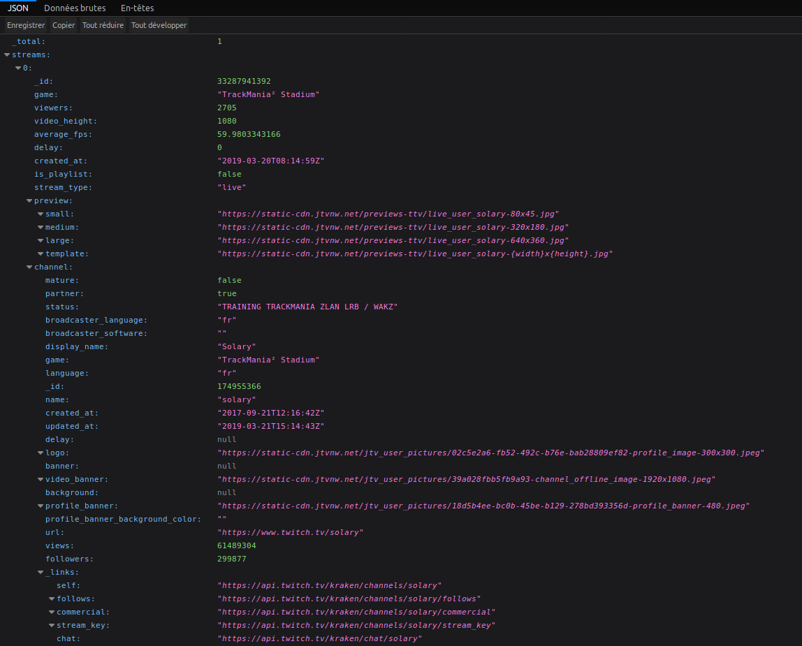
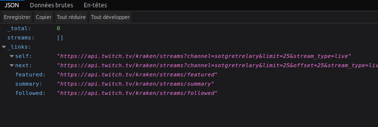

# Comment utiliser une API TWITCH


Pour commencer voici le lien que twitch développeur donne afin de voir un rendu.

```https://api.twitch.tv/kraken/streams/``` On va s'attaquer au channel(utilisateur twitch exemple: solary) une fois que s'est fait, on va s'attaquer au client_id (c'est nous).  

Le lien fini devrait donner ceci:    

```https://api.twitch.tv/kraken/streams/?channel=solary&client_id=b6bustu47nbmaftgi0v8tldtt4jqcye``` (FAKE CLÉ :D).   


Tester le lien dans votre navigateur "FIREFOX DEVELOPPEUR" le plus optimisé(mon avis).




``` 
<?php
require 'key.php';
$users = array('solaryhs', 'solary', 'doigby','test');

for ($i = 0; $i < count($users); $i++) {
    $json_file = file_get_contents("https://api.twitch.tv/kraken/streams/?channel={$users[$i]}&client_id={$client_id}");
    $json_array = json_decode($json_file, true);
    // echo ('');
    if ($json_array['streams'] != null) {
        echo ('');
        // echo ('<iframe src="https://player.twitch.tv/?channel='.$json_array['streams'][0]['channel']['display_name'].'" frameborder="0" allowfullscreen="true" scrolling="no" height="378" width="620"></iframe>');
    } else {
        echo ('<div><a href=""><i class="fab fa-twitch"> Le joueur '. $users[$i]. '  n\'est pas en ligne...</i></a></div>');
    }
}
?> 
```

Dans mon code ci-dessus, vous-trouverez que ma condition touche directement le [streams]




Ma condition dit que si le tableau [streams] est différent de rien du tout(null) alors il met en ligne, si il y a rien dedans alors il met pas en ligne.

### Afficher le flux du stream en image 

Nous avons la commande ``` echo (''); ```

On peu l'afficher en tout 

- petit = small
- moyen = medium
- en grand = large
- Il existe aussi template	"https://static-cdn.jtvnw.net/previews-ttv/live_user_solary-{width}x{height}.jpg"

Pour cela on va utiliser une commande fixe et on va juste changer la taille.

 ```echo ('');```

 ### Afficher le flux du stream

 On va s'attaquer au ```['streams'][0]['channel']['display_name']``` p  our qu'il prenne bien en compte le pseudo du joueur.

 ```echo ('<iframe src="https://player.twitch.tv/?channel='.$json_array['streams'][0]['channel']['display_name'].'" frameborder="0" allowfullscreen="true" scrolling="no" height="378" width="620"></iframe>')```   
 
 
 
 # Table des matières

1. [Introduction](#Introduction) Pouvoir utiliser une api et la comprendre.
    1. [API Twitch C'est quoi?](./API) Introduction à l'api twitch.
2. [Php version 1](./v1) Affiche si une personne est en ligne ou non.
    1. [Php version 2](./v2) Affiche si une personne est en ligne ou non avec une image.
    2. [Php version 3 pannel admin](./v3%20admin) Affiche si une personne est en ligne ou non avec une image, un pannel admin est crée.
3. [Javascript](./javascript)
    1. [Javascript Ajax](./javascript/v1) Page déjà construite avec disign.