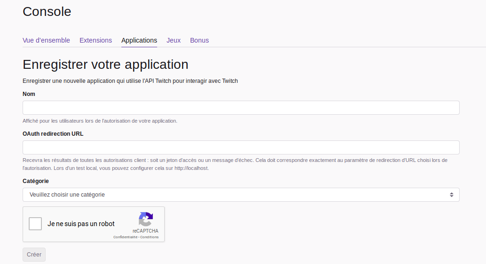
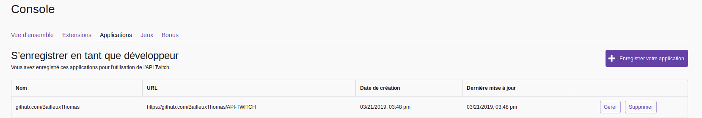
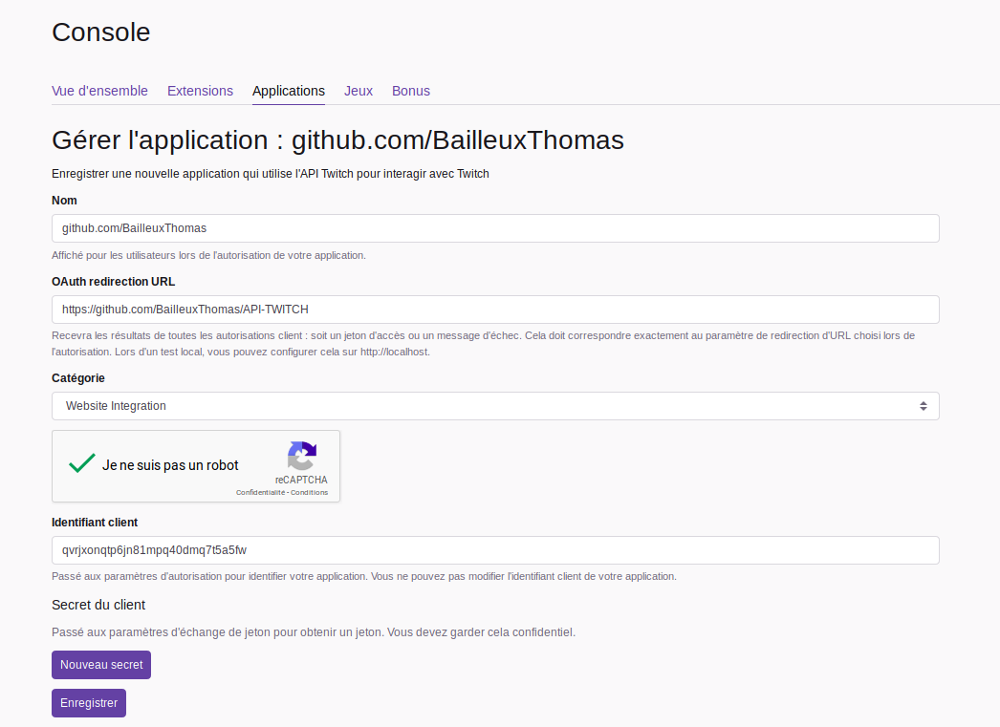

# Twitch API Php et Javascript

J'ai mis au point, plusieurs versions afin d'avoir plusieurs possibilités.  

Dans ce tutoriel, vous allez apprendre à vous servire de mon code mais surtout comment utiliser le twitch api.  
Vous trouverez aussi un code en Javascript, ce code je l'ai trouvé sur le net, et je n'y est pas touché.  

 # Table des matières

1. [Introduction](#Introduction) Pouvoir utiliser une api et la comprendre.
    1. [API Twitch C'est quoi?](./API) Introduction à l'api twitch.
2. [Php version 1](./v1) Affiche si une personne est en ligne ou non.
    1. [Php version 2](./v2) Affiche si une personne est en ligne ou non avec une image.
    2. [Php version 3 pannel admin](./v3%20admin) Affiche si une personne est en ligne ou non avec une image, un pannel admin est crée.
3. [Javascript](./javascript)
    1. [Javascript Ajax](./javascript/v1) Page déjà construite avec disign.

# Introduction

Tout d'abord, pour pouvoir utiliser une api twitch, il faut s'inscrire sur le site de développement twitch.

[Inscription](https://dev.twitch.tv/console/apps/create)

Cliquer sur gérer.   

Vous trouverez votre identifiant client (clé).

## FAITE BIEN ATTENTION A NE PAS DIVULGUER VOTRE CLÉ.  

# Table des matières

1. [Introduction](#Introduction) Pouvoir utiliser une api et la comprendre.
    1. [API Twitch C'est quoi?](/API) Introduction à l'api twitch.
2. [Php version 1](./v1) Affiche si une personne est en ligne ou non.
    1. [Php version 2](./v2) Affiche si une personne est en ligne ou non avec une image.
    2. [Php version 3 pannel admin](./v3%20admin) Affiche si une personne est en ligne ou non avec une image, un pannel admin est crée.
3. [Javascript](./javascript)
    1. [Javascript Ajax](./javascript/v1) Page déjà construite avec disign.s